# Endpoint List

---
- [Accounts](#accounts)
  - [`profile`](#profile)
  - [`profileImage`](#profile-image)
  - [`user`](#user)
  - [`userExists`](#user-exists)
  - [`defaultUserCheck`](#default-user-check)
  - [`oauth_signIn`](#sign-in)
  - [`twitter_oauth_token`](#twitter-oauth)
  - [`signIn`](#sign-in)
  - [`signUp`](#sign-up)
  - [`signOut`](#sign-out)
  - [`startAnonymousSession`](#start-anonymous-session)
  - [`forgotPassword`](#forgot-password)
  - [`resetPassword`](#reset-password)
  - [`account`](#account)
  - [`password`](#password)
- [Internal System](#internal-system)
  - [`version`](#version)
  - [`headerTokenKey`](#header-token-key)
  - [`endpoint`](#endpoint)
  - [`health`](#health)
  - [`reload`](#reload)
- [CMS](#cms)
  - [`file`](#file)
- [Admin](#admin)
  - [`user`](#user-admin)
  - [`userRole`](#user-role)
- [Data](#data)
  - [`query`](#query)
  - [`updateAll`](#update-all)
  - [`create`](#create)
  - [`update`](#update)
  - [`upload`](#upload)
- [Analytics](#analytics)
  - [`event`](#event)

---

## Accounts

---

### `profile`
 __GET__ `/common/accounts/profile/1.0.0`

The profile endpoints allow you to view and update additional information you want to keep on your user objects. Certain properties of a user object cannot be modified directly (`id`, `object_type`, `is_active`, `username`, `password`, `salt`, `created_at`, `modified_at`, and `roles`), but aside from those, you are free to modify or create new properties to let your user model store whatever information you see fit. It should also be noted that additional profile properties are added automatically when a user signs up using `oauth`.

__Headers:__

`Content-Type: application/json`

`bs_api_token: [AUTH TOKEN]`

__Returns:__

`profile` object of user associated with this auth token.

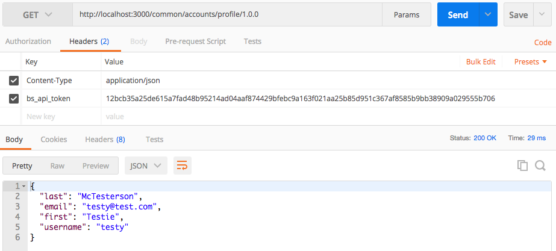

---

### `profileImage`
Currently the `profileImage` endpoints are disabled. They only return an empty object.

---

### `user`
__GET__ `/common/accounts/user/1.0.0`

This endpoint takes a `username` and returns the `user` object (minus the `password`, `salt`, `forgot_password_tokens` and other sensitive info).

__Headers:__

`Content-Type: application/json`

`bs_api_token: [AUTH TOKEN]`

__Arguments:__

`username: string` (required)

__Returns:__

`user` object minus sensitive information.

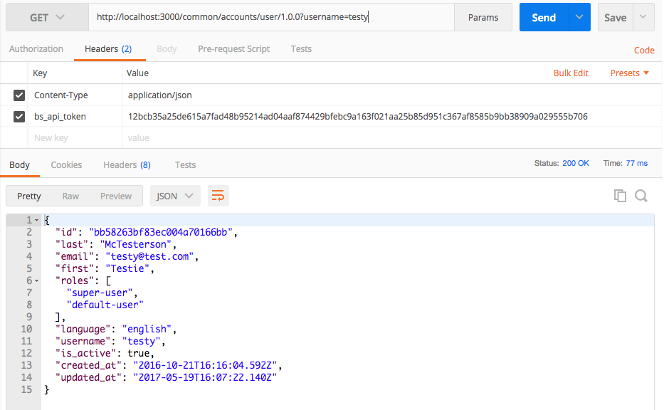

---

### `userExists`
__GET__ `/common/accounts/userExists/1.0.0`

Given a username, this endpoint either returns a success notification `{ 'user_exists': true }` or it fails with http_status 400.

__Headers:__

`Content-Type: application/json`

`bs_api_token: [AUTH TOKEN]`

__Arguments:__

`username: string`

__Returns:__

`{ user_exists: [BOOLEANS] }`

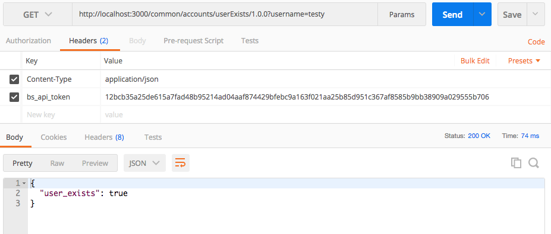

---

### `defaultUserCheck`
__GET__ `/common/accounts/defaultUserCheck/1.0.0`

This endpoint checks to see if the default super-user (bsuser) exists. The web console uses this endpoint and on initial startup prompts the user to setup a password for that user. Using bsuser and the password entered during setup, the user can then add other users.

__Headers:__

`Content-Type: application/json`

`bs_api_token: [AUTH TOKEN]`

__Returns:__

`{ setup_pending: [BOOLEAN], token: [FORGOT PASSWORD TOKEN] }`

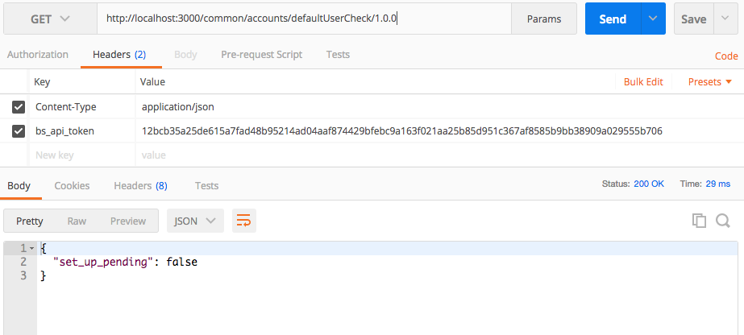

---

### `oauth_signIn`
__POST__ `/common/accounts/oauth_signIn/1.0.0`

This endpoint allows users to sign in using external credentials from Google, Facebook, and Twitter.

 __Headers:__

`Content-Type: application/json`

`bs_api_token: [AUTH TOKEN]`

 __Arguments:__

`auth: object` (required) - An object containing response tokens from `oauth` provider

`service: string` (required) - Name of the `oauth` provider

`clientInfo: string` - ANy additional info about this log in (from browser, from app, etc)

---

### `twitter_oauth_token`
__POST__ `/common/accounts/twitter_oauth_token/1.0.0`

This endpoint retruns the initial `oauth` token from twitter.

---

### `signIn`
__POST__ `/common/acccounts/signIn/1.0.0`

This Endpoint signs the user in using system credentials.

__Headers:__

`Content-Type: application/json`

__Arguments:__

`username: string` (required)

`password: string` (required)

`clientInfo: string`

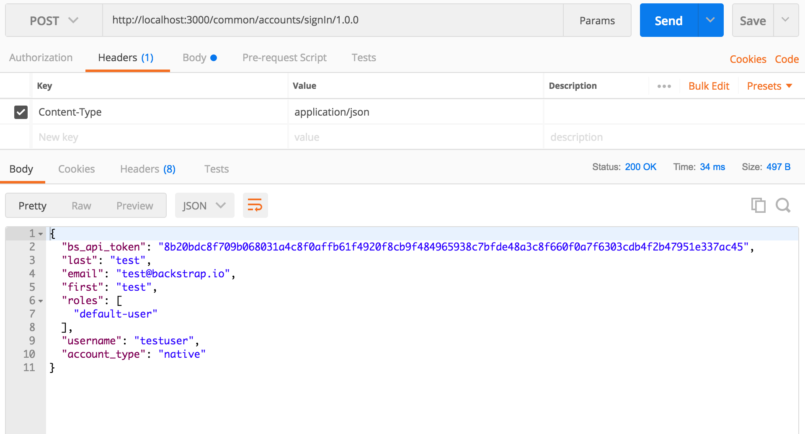

---

### `signUp`
__POST__ `/common/accounts/signUp/1.0.0`

This endpoint is used to sign up for new system credentials.

__Headers:__

`Content-Type: application/json`

__Arguments:__

`username: string` (required)

`password: string` (required)

`email: string` (required) - used for Forgot Password and Welcome Email

`first: string` - user's first name

`last: string` - user's last name

__Returns:__

Returns a new `account` object for the system

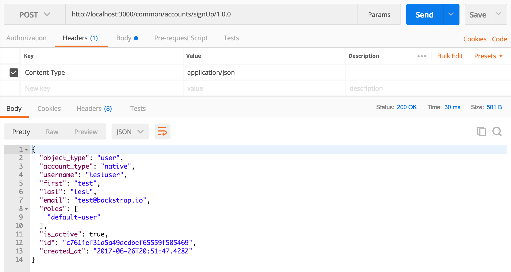

---

### `signOut`
__POST__ `/common/accounts/signOut/1.0.0`

This endpoint is used to sign out of the system.

__Headers:__

`Content-Type: application/json`

`bs_api_token: [AUTH TOKEN]`

__Returns:__

`{ sign_out: true }`

---

### `startAnonymousSession`
__POST__ `/common/accounts/startAnonymousSession/1.0.0`

This endpoint starts an anonymous session on the system.

__Headers:__

`Content-Type: application/json`

__Arguments:__

`clientInfo: string` - any additional info about this log in (from browser, from app, etc.)

__Returns:__

Returns a `session` `object_type`, detailing an anonymous `username`, and it generates a new anonymous token.

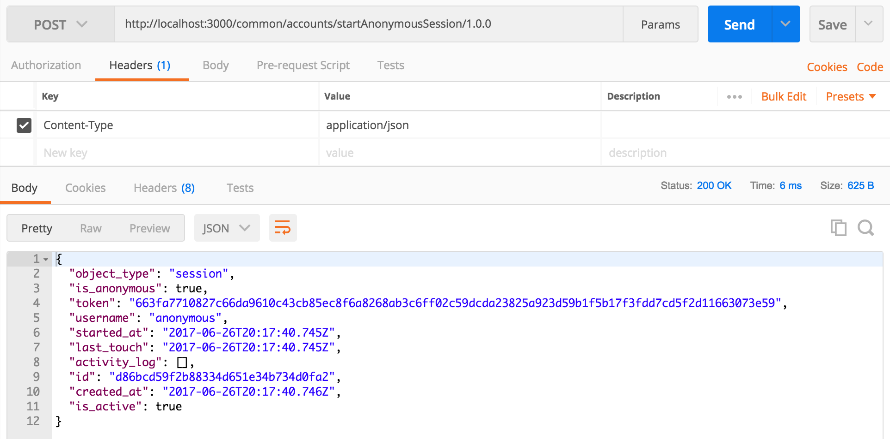

---

### `forgotPassword`
__POST__ `/common/accounts/forgotPassword/1.0.0`

This endpoint emails a token to reset the user's `password`.

__Headers:__

`Content-Type: application/json`

__Arguments:__

`username: string`

`email: string`

__Returns:__

`{ "success": [BOOLEAN] }`

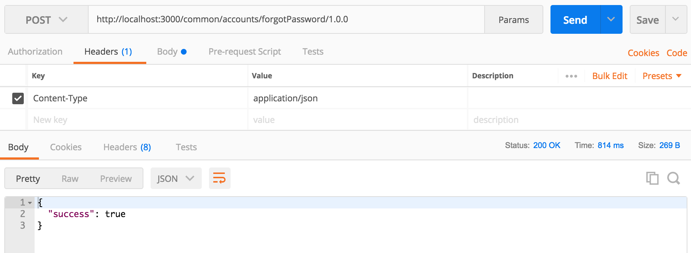

---

### `resetPassword`
__POST__ `/common/accounts/resetPassword/1.0.0`

This endpoint resets the `password` using a token.

__Headers:__

__Arguments:__

`token: string` (required)

`password: string` (required)

---

### `account`
__PUT__ `/common/accounts/account/1.0.0`

This endpoint updates the system's `account` model.

__Headers:__

`Content-Type: application/json`

`bs_api_token: [AUTH TOKEN]`

__Arguments:__

`username: string` (required)

`email: string` (required)

`first: string` (required)

`last: string` (required)

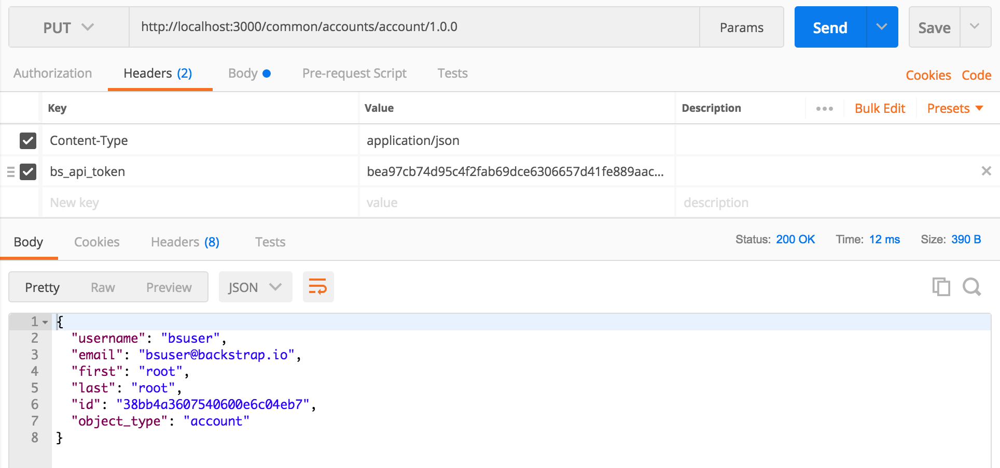

---

__DELETE__ `/common/accounts/account/1.0.0`

This endpoint updates the system's `account` model to be deactivated.

__Headers:__

`Content-Type: application/json`

__Returns:__

This endpoint has no return, only deactivates associated account.

---

### `password`
Currently the `password` endpoints are disabled. They only return an empty object.

---

## Internal System

---

### `version`
__GET__ `/common/internalSystem/version/1.0.0`

__Headers:__

`Content-Type: application/json`

__Returns:__

`{ "version": [VERSION] }`

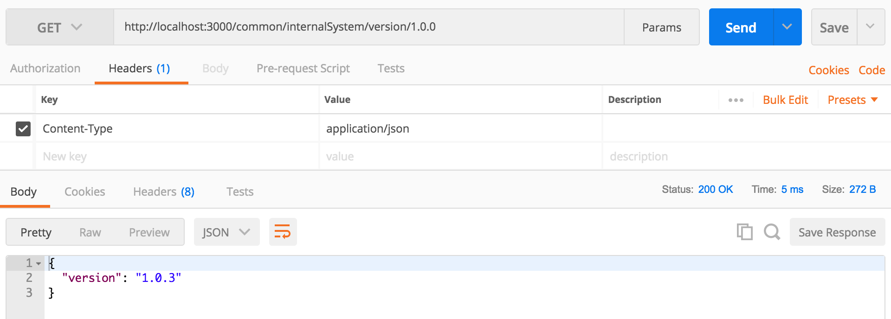

---

### `headerTokenKey`
__GET__ `/common/internalSystem/headerTokenKey/1.0.0`

__Headers:__

`Content-Type: application/json`

__Returns:__

`{ "header_token_key": "bs_api_token" }`

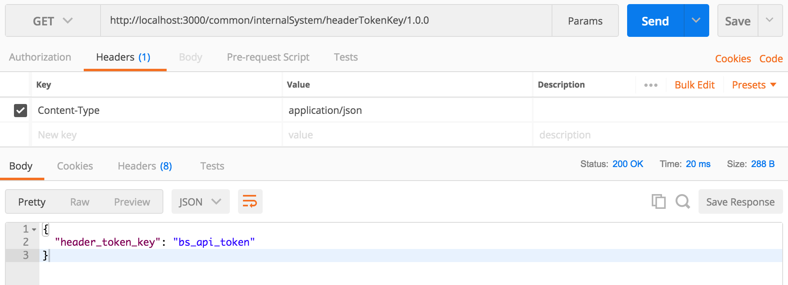

---

### `endpoint`
__GET__ `/common/internalSystem/endpoint/1.0.0`

This endpoint retrieves a model of registered service calls from the system.

__Headers:__

`Content-Type: application/json`

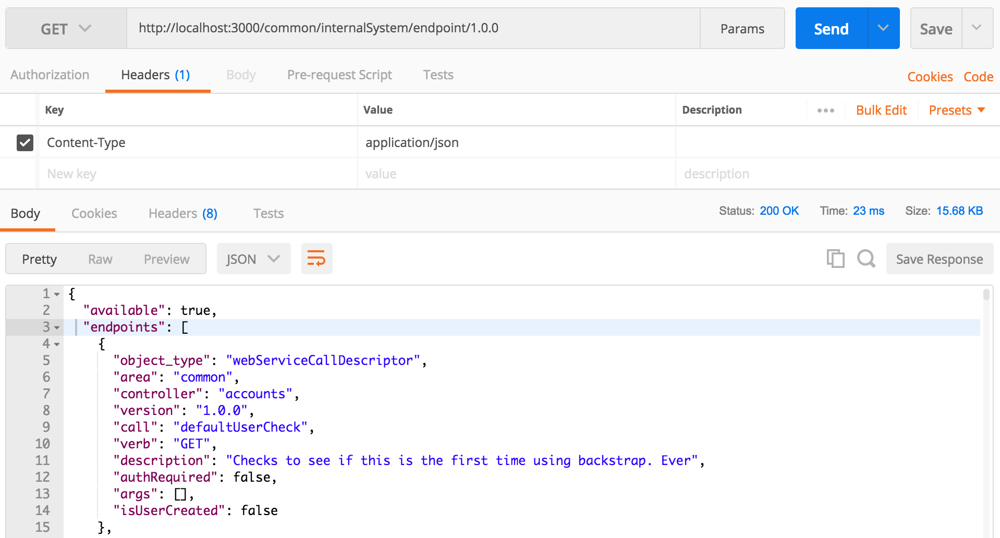

---

__POST__ `/common/internalSystem/endpoint/1.0.0`

This endpoint registers a service call with the system.

__Headers:__

`Content-Type: application/json`

`bs_api_token: [AUTH TOKEN]`

__Arguments:__

`call: string` (required)

`area: string` (required)

`controller: string` (required)

`verb: string` (required)

`version: string` (required)

`args: array` (required)

`authRequired: boolean` (required)

`description: string` (required)

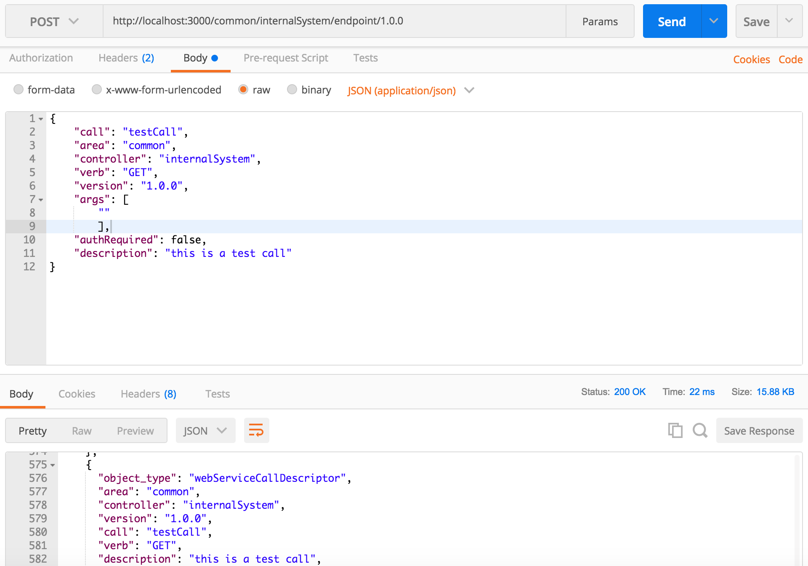

---

__PATCH__ `/common/internalSystem/endpoint/1.0.0`

This endpoint updates a registered service call that's already in the system.

__Headers:__

`Content-Type: application/json`

`bs_api_token: [AUTH TOKEN]`

__Arguments:__

`call: string` (required)

`area: string` (required)

`controller: string` (required)

`verb: string` (required)

`version: string` (required)

`args: array`

`authRequired: boolean`

`description: string`

---

__DELETE__ `/common/internalSystem/endpoint/1.0.0`

This endpoint deletes a registered service call from the system.

__Headers:__

`Content-Type: application/json`

`bs_api_token: [AUTH TOKEN]`

__Arguments:__

`call: string` (required)

`area: string` (required)

`controller: string` (required)

`verb: string` (required)

`version: string` (required)

---

### `health`

__GET__ `/common/internalSystem/health/1.0.0`

This endpoint checks the server health of the system.

 __Headers:__

`Content-Type: application/json`

 __Returns:__

`{ "status": [STATUS], "ip": [IP], "datetime": [DATETIME] }`

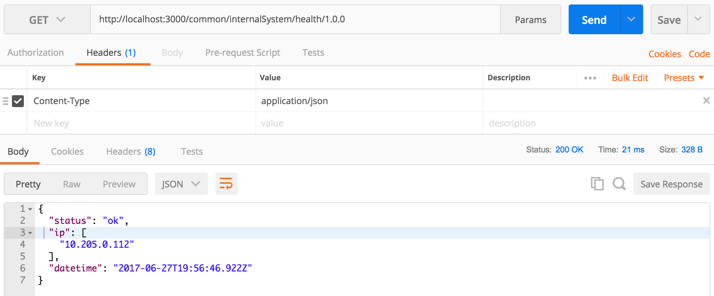

---

### `reload`
__POST__ `/common/internalSystem/reload/1.0.0`

This endpoint reloads the server config of the system.

__Headers:__

`Content-Type: application/json`

`bs_api_token: [AUTH TOKEN]`

__Returns:__

`{ "success": [BOOLEAN] }`

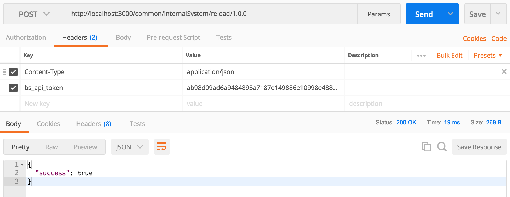

---

## CMS

---

### `file`
__GET__ `/common/cms/file/1.0.0`

This endpoint retrieves a file from the system.
__Headers:__

`Content-Type: application/json`

`bs_api_token: [AUTH TOKEN]`

__Arguments:__

`file_name: string` (required) - no extension needed

__Returns:__

`{ "file_name": [ARRAY] }`

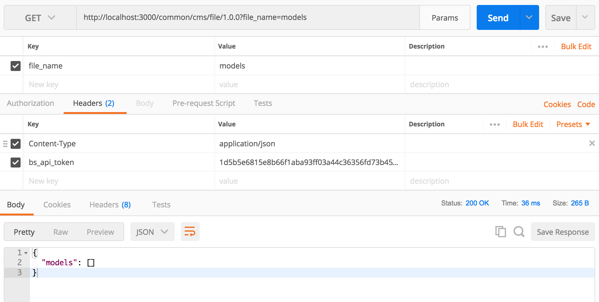

---

__POST__ `/common/cms/file/1.0.0`

This endpoint posts a new file to the system.

__Headers:__

`Content-Type: application/json`

`bs_api_token: [AUTH TOKEN]`

__Arguments:__

`file_name: string` (required) - no extension needed

---

## Admin

---

### `user`
__GET__ `/common/admin/user/1.0.0`

This endpoint retrieves a list of users from the system.

__Headers:__

`Content-Type: application/json`

`bs_api_token: [AUTH TOKEN]`

__Arguments:__

`username: string`

`id: string`

`email: string`

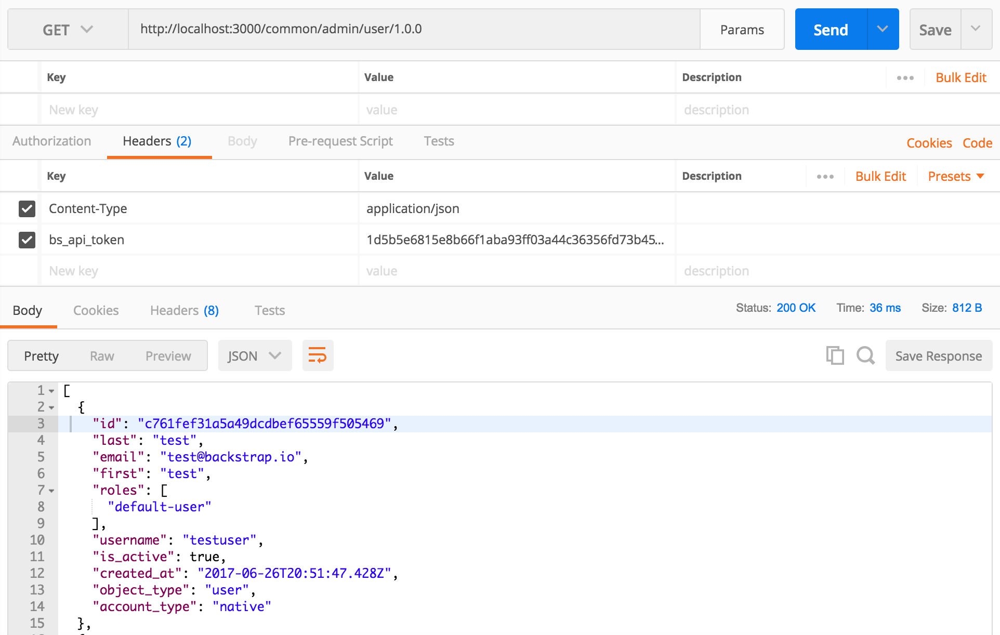

---

__POST__ `/common/admin/user/1.0.0`

This endpoint adds a new user to the system.

__Headers:__

`Content-Type: application/json`

`bs_api_token: [AUTH TOKEN]`

__Arguments:__

`username: string` (required)

`id: string` (required)

`email: string` (required)

`first: string`

`last: string`

`roles: array`

`userprofile: object`

---

__PATCH__ `/common/admin/user/1.0.0`

This endpoint updates a user model in the system.

__Headers:__

`Content-Type: application/json`

`bs_api_token: [AUTH TOKEN]`

__Arguments:__

`username: string`

`id: string` (required)

`email: string`

`first: string`

`last: string`

`roles: array`

`userprofile: object`

---

__DELETE__ `/common/admin/user/1.0.0`

This endpoint deletes a user from the system.

__Headers:__

`Content-Type: application/json`

`bs_api_token: [AUTH TOKEN]`

__Arguments:__

`id: string` (required)

---

### `userRole`
__GET__ `/common/admin/userRole/1.0.0`

This endpoint retrieves a user's role from the system.

__Headers:__

`Content-Type: application/json`

`bs_api_token: [AUTH TOKEN]`

__Arugments:__

`username: string` (required)

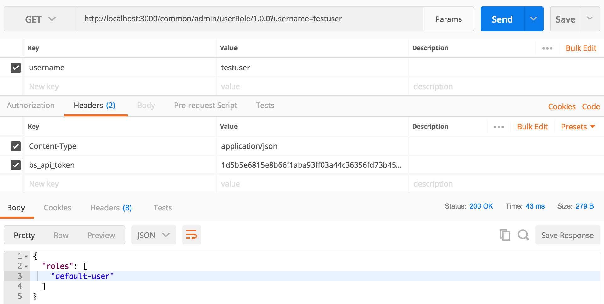

---

__POST__ `/common/admin/userRole/1.0.0`

This endpoint adds a new `userRole` to a user's model in the system.

__Headers:__

`Content-Type: application/json`

`bs_api_token: [AUTH TOKEN]`

__Arguments:__

`username: string` (required)

`role: string` (required) - super-user, default-user, admin-user

__Returns:__

`{ "success": [BOOLEAN] }`

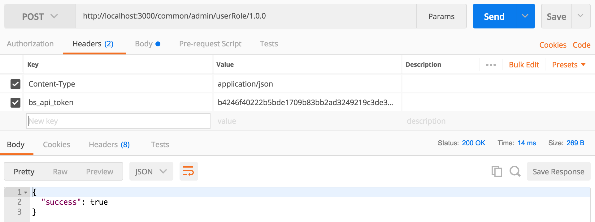

---

__DELETE__ `/common/admin/userRole/1.0.0`

This endpoint deactivates a user's `userRole`.

__Headers:__

`Content-Type: application/json`

`bs_api_token: [AUTH TOKEN]`

__Arguments:__

`username: string` (required)

`role: string` (required)

__Returns:__

`{ "success": [BOOLEAN] }`

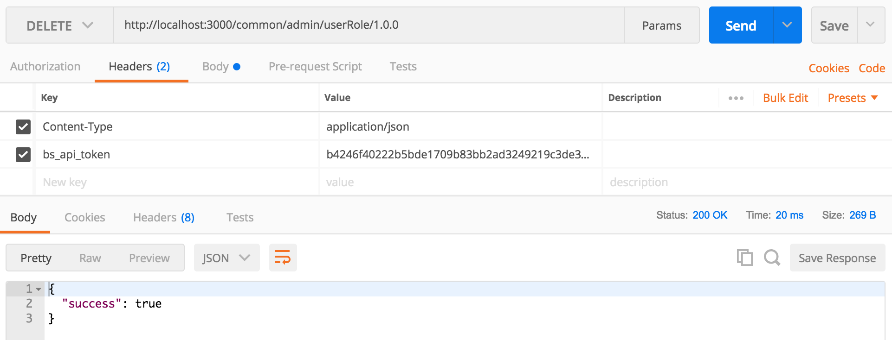

---

## Data

---

### `query`
__GET__ `/common/data/query/1.0.0`

__Headers:__

`Content-Type: application/json`

`bs_api_token: [AUTH TOKEN]`

---

__POST__ `/common/data/query/1.0.0`

__Headers:__

`Content-Type: application/json`

`bs_api_token: [AUTH TOKEN]`

__Arguments:__

`query_object: object`

---

### `updateAll`
__POST__ `/common/data/updateAll/1.0.0`

This endpoint updates all the entities within the system.

__Headers:__

`Content-Type: application/json`

`bs_api_token: [AUTH TOKEN]`

__Arguments:__

`update_all_object: object` (required)

---

### `create`
__POST__ `/common/data/create/1.0.0`

This endpoint creates a new entity within the system.

__Headers:__

`Content-Type: application/json`

`bs_api_token: [AUTH TOKEN]`

__Arguments:__

`create_object: object`

---

### `update`
__POST__ `/common/data/update/1.0.0`

This endpoint updates an entity within the system.

__Headers:__

`Content-Type: application/json`

`bs_api_token: [AUTH TOKEN]`

__Arguments:__

`update_object: object`

---

### `upload`
__POST__ `/common/data/upload/1.0.0`

This endpoint uploads a file to the system.

__Headers:__

`Content-Type: application/json`

`bs_api_token: [AUTH TOKEN]`

__Arguments:__

`file_data: file` (required)

`file_name: string` (required)

`file_destination: string`

`remote_save: [BOOLEAN]`

---

## Analytics

---

### `event`
__POST__ `/common/data/event/1.0.0`

This endpoint logs an analytics event.

__Headers:__

`Content-Type: application/json`

`bs_api_token: [AUTH TOKEN]`

__Arguments:__

`event_descriptor: object` (required) - an object describing the event to be logged (including timestamp)

---
