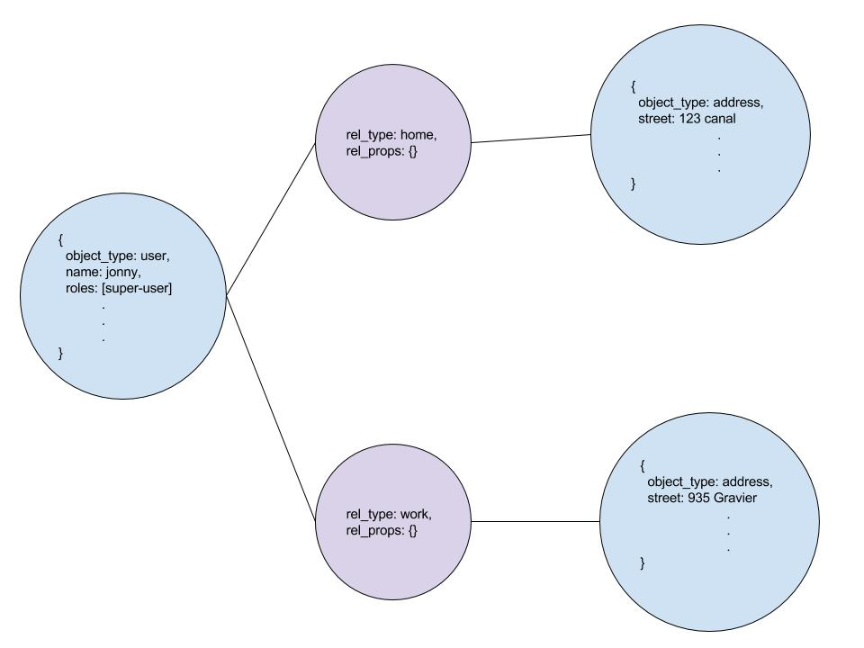
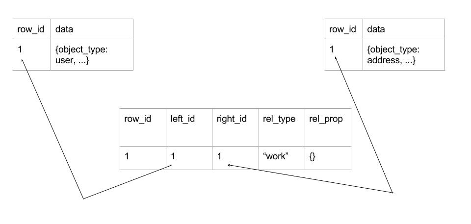

# Backstrap

---

__Backstrap__ is a Node.js framework to facilitate the design, creation, and maintenance of back-end APIs. This means that a user can quickly spin up a new back-end which includes all of the basic functionality of an API, and through the use of the Angular.js console built-in to each instance of BS, can add/modify/delete data models, custom endpoints, security rules, and any other aspects of the system. It is designed to run either as a single instance or a distributed network.

---

## Table of Contents

---

- [Getting Started](#getting-started)
	- [Prerequisites](#prerequisites)
	- [Quickstart](#quickstart)
	   - [Crash Course](#ccourse)
- [Overview](#overview)
	- [Infrastructure](#infrastructure)
		- [Single Instance Elastic Beanstalk](#single-instance)
		- [Distributed Elastic Beanstalk](#distributed-config)
	- [Components](#components)
		- [General Settings](#general-settings)
		- [User Management](#user-management)
		- [Models](#models)
  - [Backstrap Data](#backstrap-data)
    - [Database](#database)


---

## <span id="getting-started">Getting Started</span>

---

These instructions will get you a copy of the project up and running on your local machine for development and testing purposes. See deployment for notes on how to deploy the project on a live system.

---

### <span id="prerequisites">Prerequisites</span>

Backstrap requires both __Node.js__ and __npm__ to run, as well as, the object-relational database system __PostgreSQL__.

---

#### Installing Node.js

If you're using OS X or Windows, the best way tp install Node.jsis to use one of the installers from the [Node.js download page](https://nodejs.org/en/download/). If you're using Linux, you can use the installer, or you can check NodeSource's binary distributions to see whether or not there's a more recent version that works with your system.

To test run: `node -v`. The version should be higher than v0.10.32.

#### Updating npm

Node comes with npm installed so you should have a version of npm. However, npm gets updated more frequently than Node does, so you'll want to make sure it's the latest version.
```
npm install npm@latest -g
```
To test run: `npm -v`. The version should be higher than 2.1.8.

#### Installing/Setup PostgreSQL

###### Mac OS X via Homebrew:

Install [__Homebrew__](https://brew.sh/) to `/usr/local` using the following command:
```
mkdir homebrew && curl -L https://github.com/Homebrew/brew/tarball/master | tar xz --strip 1 -C homebrew
```

Once the installation is successful run `brew doctor`.

Install __PostgreSQL__ using the following command:
```
$ brew install postgresql
 ```
Postgres can be trickier to start on mac as it does not automatically create the default postgres user.

Run `$ psql`.  If you get an error like `psql: FATAL: database {yourusername} does not exist`, you need to creat the default database for you user.

To fix this, run `$ createdb`.

Run `$ psql` again and you should enter the Postgres CLI for your user. Run `$ \q` to exit.


###### Linux:
The default repositories contain PostgreSQL packages, so we can install these easily using the `apt` packaging system.
```
$ sudo apt-get updated
$ sudo apt-get install postgresql postgresql-contrib
```
###### Windows:
  1. Download and run the [Windows PostgreSQL one click installer].
  2. Install PostgreSQL as a Windows Service
  3. Keep track of the __PostgreSQL Windows Service__ account name and password. LabKey Server doesn't really care what this password is set to, but we need to ask for it so that we can pass it along to the PostgreSQL installer.
  4. Keep track of the __database superuser__ name and password. You'll need these to configure LabKey Server. LabKey Server uses this password to authenticate itself to PostgreSQL.
  5. Select the PL/pgsql procedural language for installation when prompted by the installer.

---

### <span id="quickstart">Quickstart</span>

To get __Backstrap__ up and running locally first you must clone the repository to your machine.

Make sure __Postgres__ is running, using `$ psql`, and in the Backstrap directory run `$ npm install`.

To start the project run `$ NODE_ENV=local npm start`.

---

#### <span id="ccourse">Crash Course</span>

__Where is everything?__

Most files of interest found in the project root, including the main Node server file, `BackstrapServer.js`, and the main controller, `controller.js`.

Endpoint controllers may be found in the `/common` directory.

__Configuration files__

Backstrap has four main configuration files:
  - `Settings.json` - the fundamentals: server port, timeout, auth headers, email account options, etc.
  - `Security.json` - define user roles for the api and what areas, controllers, methods each role may access.
  - `Models.json` - describe your models.
  - `Endpoints.json` - describes all API endpoints and their parameters.

---

## <span id="overview">Overview</span>

---

### <span id="infrastructure">Infrastructure<span>

__Backstrap__ is designed to run in a multitude of environments and setups. For development, the server and database can be ran on a single machine. For low-scale applications the server can be deployed to an EC2 instance with an associated RDS database. And for high-scale applications, the system can be ran as a fully distributed, horizontally-scalable back-end.

Backstrap is optimized to run with Elastic Beanstalk to leverage AWS's Elastic load-balancer, and auto-scaling groups of EC2 instances along with RDS for the Postgres database and s3 to hold shared config files. However, all that is actually required to run as a distributed system is a load-balancer, set of Backstrap servers, a shared database, and shared config files. Any environment with those components will be able to run Backstrap as a full distributed system.

---

#### <span id="single-instance">Single Instance Elastic Beanstalk</span>


This is a sinlge instance of backstrap running behind a load-balancer and using an RDS postgres instance. In this configuration, the single Backstrap server will use its own local JSON config files (`Settings.json`, `Security.json`, `Endpoints.json`, and `Models.json`). This is the standard running mode.

#### <span id="distributed-config">Distributed Elastic Beanstalk</span>


In this configuration, we have multiple Backstrap servers running alongside each other. The big blue box is a VPC within AWS. They are all connected to a single RDS instance of Postgres and they all use the same JSON config files found in an Amazon S3 bucket.

To utilize the distributed mode, Backstrap requires the presence of an environment variable called `BS_REMOTE` set to the value `"true"`. This will indicate to the other servers that they should use the JSON config files found in their pre-defined S3 bucket. The credentials for S3 are stored as environment variables. Each instance can serve up the API and the web console, so the load-balancer can connect any type of call to any of the Backstrap instances.

Changes to the database are reflected across all servers (since they are all connected to the same db). However, the JSON config files on S3 are slightly more complicated.

In order to assure that Backstrap runs quickly, the config files are read into the memory of each server on launch. In single-instance mode, any changes made using the web console are immediately made to both the local config file and the in-memory data. But in distributed mode, the changes must be made to the remote config files on S3, and changing the in-memory data of a single server means that only those connections routed to that server will have updated configs. Therefore, whenever a change is made to the config files in distributed mode, a request to reload must be made to all other instances.


As mentioned in __Step 2__, the IP's of all servers are kept in the `settings.json` file on S3. Whenever a new instance of Backstrap spins up, it modifies that file by adding its own ip/port. The instance on which the changes were initiated uses this info to login with system credentials (to get an api token), and then issues the `reload()` call to all other servers.

---

### <span id="components">Components</span>

__Backstrap__ is designed to be flexible enough to support any type of API a user may need. Whether a model-view-controller style back-end responsible for delivering data models to and from a client, or a remote procedure call style functional approach, Backstrap can handle the requirements. Let's look at the various subsystems which support these behaviors.

---

##### <span id="general-settings">General Settings</span>

```
{
    "token_header": "bs_api_token",
    "timeout_check": 15,
    "timeout": 120,
    "server_port": 3000,
    "servers": [],
    "mail_options": {
        "account": "backstrap.info@gmail.com",
        "service": "gmail",
        "user": "backstrap.info@gmail.com",
        "pass": "some_password"
    }
}
```
`token_header` is the name of the custom http header which carries the api token. For example, this configuration means that on authenticated requests, Backstrap will look for a header called `bs_api_token` and use its value as the token.

`timeout_check` sets how often each instance of Backstrap will check for timed out sessions in minutes. Every 15 minutes, the server will check for timed out sessions.

`timeout` is how long (in minutes) a session will stay active with no activity. If no activity has been detected in 120 minutes, the next time the `timeout_check` runs, the session will be deactivated and archived.

`server_port` defines which port the express server will run on. Note that this can be overridden by an environment variable (for example, Elastic Beanstalk overrides this to 8081).

`servers` is a list of ip addresses of other instances of Backstrap in a distributed network. This is not used for single instance setups of Backstrap and we will discuss it further in the section on Backstrap as a distributed system.

`mail_options` are used to set up __nodemailer__ which is responsible for sending out forgot password tokens. In this case, the server is hooked up to a gmail account.

##### <span id="user-management">User Management</span>

```
{
    "roles": [
        {
            "name": "super-user",
            "title": "Super User",
            "created_by": "marnold",
            "created_date": "8/16/2016",
            "pattern_matches": [
                "Area: common"
            ],
            "description": "This is a super user. They can do everything!",
            "areas": [
                {
                    "name": "common",
                    "permission": "all"
                }
            ]
        },
        {
            "name": "default-user",
            "title": "Default User",
            "created_by": "marnold",
            "created_date": "8/14/2016",
            "pattern_matches": [
                "Area: common | Controller: accounts",
                "Area: common | Controller: analytics",
                "Area: common | Controller: cms"
            ],
            "description": "This is a default user. They can do some stuff!",
            "areas": [
                {
                    "name": "common",
                    "permission": "some",
                    "validRoutes": [
                        {
                            "controller": "accounts",
                            "version": "1.0.0",
                            "permission": "all"
                        },
                        {
                            "controller": "analytics",
                            "version": "1.0.0",
                            "permission": "all"
                        },
                        {
                            "name": "cms",
                            "permission": "all"
                        }
                    ]
                }
            ]
        },
        {
            "title": "Another User",
            "name": "another_user",
            "description": "asdf",
            "created_date": "2016-09-02T21:53:16.589Z",
            "pattern_matches": [
                "Area: common | Controller: internalSystem",
                "Area: common | Controller: accounts | Method: signIn | Verb: POST"
            ],
            "areas": [
                {
                    "name": "common",
                    "permission": "some",
                    "validRoutes": [
                        {
                            "controller": "internalSystem",
                            "permission": "all",
                            "version": "1.0.0"
                        },
                        {
                            "controller": "accounts",
                            "permission": "some",
                            "version": "1.0.0",
                            "methods": [
                                {
                                    "verb": "POST",
                                    "call": "signIn"
                                }
                            ]
                        }
                    ]
                }
            ]
        }
    ]
}
```

`super-user` is given access to everything inside the "common" area.

`default-user` has access to the accounts, analytics, and cms controllers in the common area

`another_user` has access to the entire `internalSystem` controller inside of the common area, but only the `signIn` method of the accounts controller in that same area

##### <span id="models">Models</span>

```
{
    "models": [
        {
            "obj_type": "address",
            "description": "Address for a user",
            "date_created": "6/15/2016",
            "date_updated": "2016-09-01",
            "is_active": true,
            "roles": [
                "super-user"
            ],
            "properties": [
                {
                    "name": "id",
                    "data_type": "string",
                    "required": true,
                    "hint": "This is a system generated value"
                },
                {
                    "name": "name",
                    "data_type": "string",
                    "required": true
                },
                {
                    "name": "display_name",
                    "data_type": "string",
                    "required": false
                },
                {
                    "name": "street_address",
                    "data_type": "string",
                    "required": true
                },
                {
                    "name": "city",
                    "data_type": "string",
                    "required": true
                },
                {
                    "name": "state",
                    "data_type": "string",
                    "required": true
                },
                {
                    "name": "country",
                    "data_type": "string",
                    "required": true
                },
                {
                    "name": "zipcode",
                    "data_type": "string",
                    "required": true
                }
            ],
            "relationships": [
                {
                    "relates_to": "bsuser",
                    "plural_name": "bsusers",
                    "linking_table": "account_address",
                    "rel_type": "many",
                    "is_active": true
                }
            ],
            "updated_date": "2016-09-01"
        }
    ]
}
```

This file defines a single model for a user's address. You can see in the `"relationships"` section that we define that this model is associated with a user object in the system. Also of note is that the data type is specified for each property and whether or not this model requires that property to be filled out.

This gets used by the system to validate arguments to endpoints. You can also see that there is a set of user roles associated with each model. This is used to determine whether a web console user can modify that model or not.

##### <span id="endpoints">Endpoints</span>

```
{
    "common": [
        {
            "name": "accounts",
            "version": "1.0.0",
            "methods": [
                {
                    "verb": "POST",
                    "call": "signIn",
                    "desc": "Sign in using system credentials",
                    "authRequired": false,
                    "args": [
                        {
                            "name": "username",
                            "type": "string",
                            "isRequired": true,
                            "description": null
                        },
                        {
                            "name": "password",
                            "type": "string",
                            "isRequired": true,
                            "description": null
                        },
                        {
                            "name": "clientInfo",
                            "type": "string",
                            "isRequired": false,
                            "description": "Any additional info about this log in (from browser, from app, etc)"
                        }
                    ]
                },
                {
                    "verb": "POST",
                    "call": "signUp",
                    "desc": "Sign up for new system credentials",
                    "authRequired": false,
                    "args": [
                        {
                            "name": "username",
                            "type": "string",
                            "isRequired": true,
                            "description": null
                        },
                        {
                            "name": "password",
                            "type": "string",
                            "isRequired": true,
                            "description": null
                        },
                        {
                            "name": "email",
                            "type": "string",
                            "isRequired": true,
                            "description": "Used for Forgot Password and Welcome Email"
                        }
                    ]
                }
            ]
        }
    ]
}
```

This shows the `signin` and `signup` methods in the accounts controller v1.0.0 within the common area. These map to the urls
```
/common/accounts/signin/1.0.0
/common/accounts/signup/1.0.0
```

In the filesystem, this maps to a directory in the Backstrap root called `common` Within that directory is a file called `accounts_1_0_0.js` for controller `accounts` version `1.0.0`. And in that file there is a method defined within the POST block.

Let's look at the actual controller files and their setup. Here is `internalSystem_1_0_0.js`:

```
// ===============================================================================
// INTERNAL SYSTEM WEB SERVICE CALLS v1.0.0
// ===============================================================================
var dataAccess;
var utilities;
var accessControl;
var serviceRegistration;
var settings;
var models;
var Q = require('q');
var os = require('os');
var crypto = require('crypto');

var endpointFileUid = crypto.randomBytes(12).toString('hex');

var InternalSystem = function(da, utils, ac, sr, st, m) {
    dataAccess = da;
    utilities = utils;
    accessControl = ac;
    serviceRegistration = sr;
    settings = st;
    models = m;
};

InternalSystem.prototype.get = {
    version: function(req, callback) {
        var deferred = Q.defer();
        deferred.resolve('1.0.0');
        deferred.promise.nodeify(callback);
        return deferred.promise;
    },
    endpoint: function(req, callback) {
        var deferred = Q.defer();
        var fileUid = req.query.uid;
        serviceRegistration.getAllServiceCalls()
        .then(function(serviceCalls) {
            if (fileUid !== endpointFileUid){
                deferred.resolve({success:true, uid:endpointFileUid, available: true, endpoints: serviceCalls});
            }
            else{
                deferred.resolve({success:true, uid:endpointFileUid, available: false, endpoints: null});
            }
        })
        .fail(function(err) {
            deferred.reject({success:false, uid: endpointFileUid, endpoints: null});
        });

        deferred.promise.nodeify(callback);
        return deferred.promise;
    },
    health: function(req, callback) {
        var deferred = Q.defer();

        var interfaces = os.networkInterfaces();
        var ips = [];
        for (var i in interfaces) {
            for (var j in interfaces[i]) {
                var address = interfaces[i][j];
                if (address.family === 'IPv4' && !address.internal) {
                    ips.push(address.address);
                }
            }
        }

        var healthObj = {
            'status': 'ok',
            'ip': ips,
            'datetime': new Date()
        };
        deferred.resolve(healthObj);

        deferred.promise.nodeify(callback);
        return deferred.promise;
    }
};

InternalSystem.prototype.post = {
    reload: function(req, callback) {
        var deferred = Q.defer();

        accessControl.reload()
        .then(function(ac_res) {
            console.log('Access Control reloaded');
            return settings.reload();
        })
        .then(function(set_res) {
            console.log('Settings reloaded');
            return models.reload();
        })
        .then(function(mod_res) {
            console.log('Models reloaded');
            return serviceRegistration.reload();
        })
        .then(function(sr_res) {
            console.log('Service Registration reloaded');
            deferred.resolve({'success': true});
        })
        .fail(function(err) {
            deferred.reject(err);
        });

        deferred.promise.nodeify(callback);
        return deferred.promise;
    },
    endpoint: function(req, callback) {
        var deferred = Q.defer();
        var inputArgs = req.body;
        var call = inputArgs.call;
        var area = inputArgs.area;
        var controller = inputArgs.controller;
        var verb = inputArgs.verb;
        var version = inputArgs.version;
        var args = inputArgs.args;
        var requiresAuth = inputArgs.requiresAuth;
        var description = inputArgs.description;
        serviceRegistration.registerServiceCall(call, area, controller, verb, version, args, requiresAuth, description)
        .then(function(registration_result) {
            endpointFileUid = crypto.randomBytes(12).toString('hex');
            serviceRegistration.getAllServiceCalls()
            .then(function(serviceCalls) {
                deferred.resolve({success:true, uid: endpointFileUid, endpoints: serviceCalls});
            })
            .fail(function(err) {
                deferred.reject({success:false, uid: endpointFileUid, endpoints: null});
            });
        })
        .fail(function(err) {
            deferred.reject({success:false, uid: endpointFileUid, endpoints: null});
        })

        deferred.promise.nodeify(callback);
        return deferred.promise;
    }
};

InternalSystem.prototype.put = {

};

InternalSystem.prototype.patch = {
    endpoint: function(req, callback) {
        var deferred = Q.defer();
        var inputArgs = req.body;
        var call = inputArgs.call;
        var area = inputArgs.area;
        var controller = inputArgs.controller;
        var verb = inputArgs.verb;
        var version = inputArgs.version;
        var args = inputArgs.args;
        var requiresAuth = inputArgs.requiresAuth;
        var description = inputArgs.description;
        serviceRegistration.updateServiceCall(call, area, controller, verb, version, args, requiresAuth, description)
        .then(function(update_result) {
            endpointFileUid = crypto.randomBytes(12).toString('hex');
            serviceRegistration.getAllServiceCalls()
            .then(function(serviceCalls) {
                deferred.resolve({success:true, uid: endpointFileUid, endpoints: serviceCalls});
            })
            .fail(function(err) {
                deferred.reject({success:false, uid: endpointFileUid, endpoints: null});
            });
        })
        .fail(function(err) {
            deferred.reject(err);
        })

        deferred.promise.nodeify(callback);
        return deferred.promise;
    }
};

InternalSystem.prototype.delete = {
    endpoint: function(req, callback) {
        var deferred = Q.defer();
        var inputArgs = req.body;
        var call = inputArgs.call;
        var area = inputArgs.area;
        var controller = inputArgs.controller;
        var verb = inputArgs.verb;
        var version = inputArgs.version;

        serviceRegistration.deleteServiceCall(call, area, controller, verb, version)
        .then(function(delete_res) {
            deferred.resolve(delete_res);
        })
        .fail(function(err) {
            deferred.reject(err);
        });

        deferred.promise.nodeify(callback);
        return deferred.promise;
    }
};

exports.internalSystem = InternalSystem;
```

As you can see, there is an initializer which injects dependencies. All controller files must have an initializer that looks like this in order to reach other necessary components an data in the system. Each JSON configuration file has a .js file which controls it. For example, `Models.json` has a `models.js` file which contains both the data from `Models.json` and functions for manipulating that data. The `m` passed in to the initializer is a single instance of that `models.js` file instantiated earlier and containing the data from `Models.json` as `m.data.` Also, controller files must be broken into a prototype block for each verb GET, POST, PUT, PATCH, DELETE. This is necessary for the automatic routing of urls endpoints to the correct file/function. Finally, the file must export the prototype model using the __exact same name as file including capitalization__.
`internalSystem_1_0_0.js` ↔ `exports.internalSystem`

---

### <span id="backstrap-data">Backstrap Data</span>

The internal structure of data within __Backstrap__ relies on a combination of SQL, NoSQL, and Graph type database. Each entity is a NoSQL node connected to other entities through SQL linking tables which include further information. In this way, each entity has the flexibility of NoSQL, the speed of SQL joins, and relationships which are first class citizens containing their own data.

---



This represents the relationship between a user and two addresses. One is a home address, the other a work address. The entities are in blue and the relationships in red. As you can see, the base objects are NoSQL blobs. They are joined through a linking table which has further information on the relationship, in this case, whether the address is for work or home. Among the advantages of storing data this way are the prevention of duplicate data. If a user has his/her home at another user's work address, we do not have to add the address once as a home and once as work. Instead, we can create a single address and store the type of relationship in the actual relationship itself. We also get the flexibility of adding/removing fields within the entities themselves which is how Backstrap can handle changes to models on the fly. Finally, while we do all of queries with SQL (making liberal use of json functions provided by postgres) we have the ability to traverse our data in a graph database manner. If, for example, we wanted to know about all entities connected to a user's home address, we could follow that relationship to the address entity and then query all of the other relationships stemming from there.

#### <span id="database">Database</span>

Let's look at how this relationship might be modeled in the actual db.



This shows the three tables involved in relating a user to an address. We have an account table with a user, an address table with an address, and a linking table (account_address) with all information needed for the relationship (NOTE: `rel_props` has not been fully integrated yet so can be ignored for the time being). The mapping of `left_id` to account, `right_id` to address, and the name of the linking table is all stored in memory while the system is running. These tables are autogenerated using the `Models.json` file.

Most of the operations that will need to be performed on the data have already been written in the dataAccess.js file. This contains ORM type methods used to retrieve, update, delete, add relationships, and remove relationships for models. It includes single database access methods as well as transactional multi-access methods. For example, to save an address, you could use the `dataAccess.saveEntity()` function, however, if you needed to save two addresses and did not want one to save if the other fails, you could use `dataAccess.startTransaction`, `dataAccess.t_saveEntity()` for each address to save, `dataAccess.commitTransaction()`. A failure of one insert would cause a full rollback to the pre-insert state. There are far too many functions in dataAccess to explain them all here, but most of the time, saveEntity, updateEntity, deleteEntity, join, addRelationship, removeRelationship, and find will be all that is necessary.

If you do need to add a function to dataAccess using SQL, this is a handy reference to the json operators which will be necessary: https://www.postgresql.org/docs/9.4/static/functions-json.html
